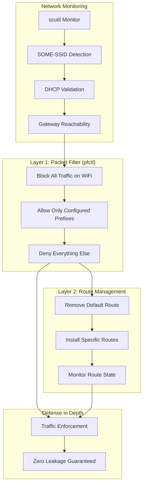
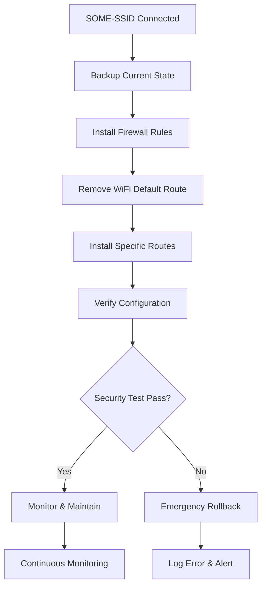

# macOS Routing Management Solution Design

## Overview

This document outlines a comprehensive macOS routing management solution that monitors WiFi connections using `scutil` and automatically manages routing tables when connecting to specific networks. The solution uses a dual-layer security approach combining firewall rules (`pfctl`) and route table manipulation to ensure bulletproof traffic isolation.

## Requirements

- Monitor for connection to "SOME-SSID" WiFi network using `scutil`
- Prevent the default route from using the WiFi interface
- Configure static list of network prefixes that route through WiFi interface
- All other traffic uses the original default route (ethernet/cellular)
- Zero traffic leakage through unauthorized routes

## Technical Architecture



## Core Components

### 1. Network State Monitor
- Uses `scutil --nwi` to monitor network interface states
- Watches for WiFi connection changes using `scutil --nc list`
- Detects "SOME-SSID" SSID connection/disconnection events

### 2. Dual-Layer Security Engine
- **Layer 1**: Firewall rules using `pfctl` (primary defense)
- **Layer 2**: Route table manipulation (secondary defense)
- **Fail-Safe**: Even if routes leak, firewall blocks unauthorized traffic

### 3. Configuration System
- File-based prefix configuration
- Dynamic interface detection
- Automatic rule generation

## Implementation Strategy

### Phase 1: Connection Detection

```bash
# Monitor for SOME-SSID connection
scutil --nwi | grep -A 10 "WiFi"
networksetup -getairportnetwork en0  # or appropriate WiFi interface

# Validate DHCP lease
ifconfig en1 | grep "inet " | grep -v "127.0.0.1"

# Extract and verify gateway
GATEWAY=$(route -n get default -ifscope en1 2>/dev/null | awk '/gateway:/ {print $2}')

# Test gateway reachability (single ping)
ping -c 1 -t 2 $GATEWAY >/dev/null 2>&1
```

### Phase 2: Firewall Configuration (Primary Defense)

#### Firewall Rule Generation

```bash
# Create firewall ruleset for WiFi interface isolation
generate_firewall_rules() {
    local config_file="/etc/wifi-daemon/prefixes.conf"
    local pf_file="/etc/wifi-daemon/pf-wifi.conf"
    local wifi_interface="en1"
    
    cat > "$pf_file" << EOF
# Auto-generated WiFi isolation rules for SOME-SSID
block out on $wifi_interface all
EOF
    
    # Add allow rules for included prefixes
    while read prefix; do
        [[ $prefix =~ ^! ]] && continue
        [[ -z $prefix ]] && continue
        echo "pass out on $wifi_interface to $prefix" >> "$pf_file"
    done < "$config_file"
    
    # Add block rules for excluded prefixes  
    while read prefix; do
        [[ $prefix =~ ^! ]] || continue
        excluded_prefix=${prefix#!}
        echo "block out on $wifi_interface to $excluded_prefix" >> "$pf_file"
    done < "$config_file"
    
    # Add essential system traffic
    cat >> "$pf_file" << EOF
pass out on $wifi_interface to 169.254.0.0/16
pass out on $wifi_interface proto udp to any port 53
pass out on $wifi_interface proto udp to any port 67
block log on $wifi_interface all
EOF
}
```

#### Firewall Activation

```bash
# Load WiFi isolation rules when SOME-SSID connects
pfctl -f /etc/wifi-daemon/pf-wifi.conf

# Enable packet filtering
pfctl -e

# Verify rules are loaded
pfctl -s rules | grep en1
```

### Phase 3: Route Management (Secondary Defense)

#### Default Route Prevention

```bash
# 1. Capture and preserve the current default route
ORIGINAL_DEFAULT=$(route -n get default | grep gateway | awk '{print $2}')
ORIGINAL_INTERFACE=$(route -n get default | grep interface | awk '{print $2}')

# 2. Remove any WiFi default route
route delete default -ifscope en1 2>/dev/null || true

# 3. Ensure original default route remains
route add default $ORIGINAL_DEFAULT -ifscope $ORIGINAL_INTERFACE

# 4. Add only specific routes through WiFi
WIFI_GATEWAY=$(route -n get default -ifscope en1 | grep gateway | awk '{print $2}')

while read prefix; do
    [[ $prefix =~ ^! ]] && continue
    [[ -z $prefix ]] && continue
    route add -net $prefix $WIFI_GATEWAY -ifscope en1
done < /etc/wifi-daemon/prefixes.conf

# 5. Remove excluded subnets from WiFi routing
while read prefix; do
    [[ $prefix =~ ^! ]] || continue
    excluded_prefix=${prefix#!}
    route delete -net $excluded_prefix -ifscope en1 2>/dev/null || true
done < /etc/wifi-daemon/prefixes.conf
```

#### Route Monitoring

```bash
# Monitor for WiFi trying to install default route
monitor_default_route() {
    while true; do
        if route -n get default | grep -q en1; then
            echo "WARNING: WiFi acquired default route, removing..."
            route delete default -ifscope en1
            # Restore original default if missing
            if ! route -n get default >/dev/null 2>&1; then
                route add default $ORIGINAL_DEFAULT -ifscope $ORIGINAL_INTERFACE
            fi
        fi
        sleep 5
    done
}
```

## Configuration Format

### Prefix Configuration (`/etc/wifi-daemon/prefixes.conf`)

```bash
# SOME-SSID Routing Prefixes
# Include these RFC1918 ranges through WiFi
10.0.0.0/8
172.16.0.0/12  
192.168.0.0/16

# Exclude these specific subnets (use original default route)
!10.219.0.0/16
!10.52.0.0/16
!172.16.0.0/16
!192.168.1.0/24
```

### Main Configuration (`/etc/wifi-daemon/config.json`)

```json
{
  "target_ssid": "SOME-SSID",
  "wifi_interface": "auto",
  "security_layers": {
    "firewall": true,
    "routing": true
  },
  "firewall_config": {
    "block_by_default": true,
    "log_blocked_traffic": true,
    "allow_system_traffic": ["dhcp", "link-local"]
  },
  "prefixes": {
    "config_file": "/etc/wifi-daemon/prefixes.conf",
    "include_rfc1918": true,
    "exclude_ranges": [
      "10.219.0.0/16",
      "10.52.0.0/16", 
      "172.16.0.0/16",
      "192.168.1.0/24"
    ]
  },
  "monitoring": {
    "route_check_interval": 5,
    "log_file": "/var/log/wifi-daemon.log"
  }
}
```

## Required macOS Commands

### Network Monitoring Commands

```bash
# WiFi state monitoring
scutil --nwi
scutil --nc list
networksetup -getairportnetwork <interface>
system_profiler SPAirPortDataType

# Interface detection
networksetup -listallhardwareports
ifconfig -a
route -n get default
```

### Firewall Management Commands

```bash
# Firewall rule management
pfctl -f <rule_file>     # Load rules from file
pfctl -e                 # Enable packet filtering
pfctl -d                 # Disable packet filtering
pfctl -F rules           # Flush all rules
pfctl -s rules           # Show current rules
pfctl -s rules -v        # Show rules with statistics

# Traffic monitoring
tcpdump -i pflog0 -n     # Monitor blocked traffic
pfctl -sr | grep en1     # Show WiFi interface rules
```

### Route Manipulation Commands

```bash
# Route analysis
netstat -rn
route -n get <destination>
route -n get default

# Route modification
route add [-net|-host] <destination> <gateway> [-ifscope <interface>] [-metric <value>]
route delete [-net|-host] <destination> [<gateway>]
route change <destination> <gateway> [-ifscope <interface>] [-metric <value>]

# Interface-specific routing
route add -net <network> -gateway <gateway> -ifscope <interface>
route delete -net <network> -ifscope <interface>
```

## Verification & Monitoring

### Firewall Verification

```bash
# Monitor blocked traffic attempts
tcpdump -i pflog0 -n | grep en1

# Check firewall rule statistics
pfctl -s rules -v | grep en1

# Test specific destination blocking
pfctl -sr | grep "block.*8.8.8.8"  # Should show block rule

# Verify allowed traffic
pfctl -sr | grep "pass.*10.0.0.0"  # Should show pass rule
```

### Route Verification

```bash
# Verify default route is NOT through WiFi
route -n get default | grep -v en1  # Should show primary interface

# Verify specific routes ARE through WiFi  
route -n get 10.1.1.1 | grep en1     # Should show WiFi interface

# List all routes by interface
netstat -rn | grep en1               # Should show only specific prefixes
```

### Combined Security Test

```bash
# 1. Verify firewall rules active
pfctl -s rules | grep -c en1

# 2. Verify no default route through WiFi
route -n get default | grep -v en1

# 3. Test allowed prefix routing
route -n get 10.1.1.1 | grep en1

# 4. Test blocked traffic (should fail)
timeout 2 ping -c 1 8.8.8.8 -b en1  # Should timeout/fail
```

## Cleanup & Disconnection

### Disconnection Cleanup

```bash
# When SOME-SSID disconnects:

# 1. Remove firewall rules
pfctl -F rules  # Flush all rules
pfctl -d        # Disable if no other rules

# 2. Clean up routes
while read prefix; do
    [[ $prefix =~ ^! ]] && continue
    [[ -z $prefix ]] && continue
    route delete -net $prefix -ifscope en1 2>/dev/null || true
done < /etc/wifi-daemon/prefixes.conf
```

## Implementation Directory Structure

```
/usr/local/bin/wifi-daemon/
├── wifi-daemon          # Main daemon
├── network-monitor         # Network state monitor
├── route-manager          # Route manipulation utility
├── firewall-manager       # Firewall rule manager
└── config-validator       # Configuration validation

/etc/wifi-daemon/
├── config.json           # Main configuration
├── prefixes.conf         # Network prefixes
├── pf-wifi.conf          # Generated firewall rules
└── interfaces.conf       # Interface mappings

/var/lib/wifi-daemon/
├── backups/             # Route backups
├── state/              # Current state files
└── logs/               # Detailed logs

/Library/LaunchDaemons/
└── com.wifi-daemon.plist  # macOS service definition
```

## Security Benefits

### Dual-Layer Protection

1. **Firewall (Primary Defense)**: Blocks traffic at packet level regardless of routing
2. **Route Management (Secondary)**: Prevents traffic from being routed incorrectly
3. **Fail-Safe**: Even if routes leak, firewall blocks unauthorized traffic
4. **Monitoring**: pflog provides detailed traffic attempt logging
5. **Granular Control**: Per-prefix allow/deny rules

### Zero Traffic Leakage Guarantee

- Default deny firewall policy on WiFi interface
- No default route through WiFi interface
- Only explicitly configured prefixes allowed
- Continuous monitoring and enforcement
- Automatic cleanup on disconnection

## Error Handling Strategy

### Safety Mechanisms

1. **Pre-execution Validation**
   - Verify current connectivity before changes
   - Validate configuration file syntax  
   - Check required permissions (root access)

2. **Atomic Operations**
   - Install firewall rules before route changes
   - Group related operations together
   - Verify each step before proceeding

3. **Rollback Procedures**
   - Restore routes from backup files
   - Remove firewall rules on failure
   - Reset interface priorities

### Implementation Flow



This design provides enterprise-grade traffic isolation with multiple enforcement layers, ensuring zero traffic leakage while maintaining connectivity for authorized network prefixes.